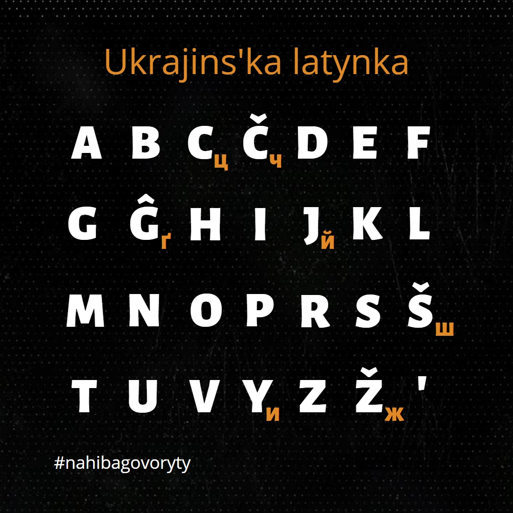
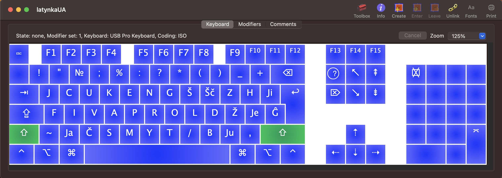

# Pryvit! 

Ce klaviatura dlja MacOS zasnovana na projekti ukrajins'koji latynky ščo bazujet'sja na ideji [Maksyma Prudeusa](https://ukr-latynka.org). 

Jakščo Vy koly-nebud' hotily sprobuvaty ukrajins'ku latynku - cej repozytorij stvorenyj same dlja taky cilej 🙂

# Čym horoša cja versija latynky?

Vse prosto - vona najprostiša sered isnujučyh.

# Sposib instaljaciji

Vykonaty komandu

```bash
git clone ...
```

Do dyrektoriji

```bash
cd ~/Library/Keyboard\ Layouts
```

Dali potribngo abo perezavantažyty systemu abo prosto zrobyty "Log out". 

Ščasty!

# Detal'niše pro abektu



# Jak vygljadaje klaviatura

Dlja zručnosti perehodu na latynku bulo obrano kyrylyčnu rozkladku klaviatury jaka drukuje latynkoju.




# Rozdumy

## Čy potribno zalyšaty literu "ї"

Na moju dumku litera "ї" - unikal'na i prytamanna lyše ukraїns'kij abetci. Shožogo zvuku nemaje u slovah "Havaii" ni u slovi "naive" - u takyh slovah zvučyt' podovžena "ee"(i).

## Čomu b ne zaminyty "je", "ju", "ja" na ščos' bil'š zručniše i ščo b skladalos' iz odnoji litery?

Sered bagat'oh avtors'kyh versij latynok možna znajty taki varianty jak:

| Ukrajins'ka kyrylyčna abetka   | [Проєкт української латинки Максима Прудеуса](https://ukr-latynka.org) | [latynka.org.ua](https://latynka.org.ua/?page_id=118) | [Na Chasi](https://nachasi.com/manifest) | [Живиця (Mikola Akbal)](https://drive.google.com/drive/folders/1ee_JCJxq4fp8ZRsCWMzYya-IZbXfN1Gi) |
|:---:|:-----:|:-----:|:-----:|:----------:|
| Я я | Ja ja | Â â   | Ja ja | Ă ă        |
| Ї ї | Ji ji | Ї ї   | Ї ї   | Ĭ ĭ        |
| Є є | Je je | Ê ê   | Je je | E e        |
| Ю ю | Ju ju | Û û   | Ju ju | Ŭ ŭ        |
| И и | Y y   | Y y   | Y y   | Ȋ  ȋ       |
| Ш Ш | Š š   | Š š   | Š š   | Ṡ ṡ        |
| Щ Щ | Šč šč | Šč šč | Šč šč | S̈ s̈        | 
| Ж ж | Ž ž   | Ž ž   | Ž ž   | Z: z: (Ż ż)|
| Й й | J j   | J j   | J j   | Y y        |
| Ч ч | Č č   | Č č   | Č č   | Ç ç        |

## Tak ščo obraty?

Usi sučasni movy ruhajut'sj u bik sproščennja, tomu nemaj nijkogo sensu korystuvatys' terminamy v styli [breve](https://en.wikipedia.org/wiki/Breve), [inverted breve](https://en.wikipedia.org/wiki/Inverted_breve), [cedilla](https://en.wikipedia.org/wiki/Cedilla), [diacritic](https://en.wikipedia.org/wiki/Diaeresis_(diacritic)) i tym bil'še literamy iz "Latin Extended-A/B/C/D/E/F..."

